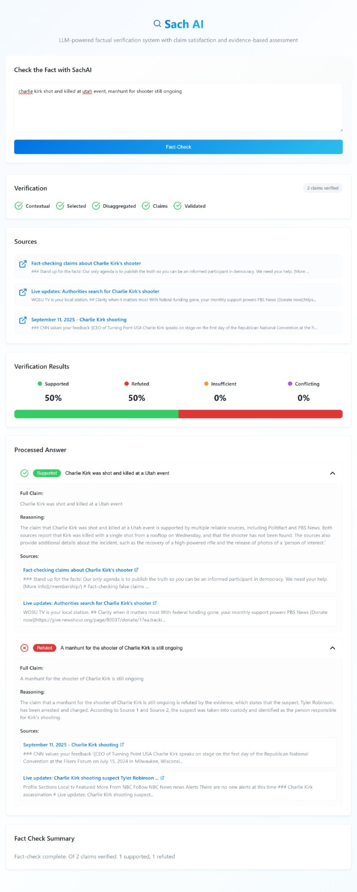

# SachAI: A Multi-Agent System for Deep Fact-Checking

**A high-speed, transparent, and extensible engine for automated factual verification.**

---

## Overview

**SachAI** is an advanced, AI-powered fact-checking application designed to combat modern, complex misinformation. Unlike traditional tools that perform superficial checks, SachAI employs a sophisticated **Multi-Agent System (MAS)** to systematically deconstruct, investigate, and verify every factual claim within a given text.

Built with Python and orchestrated by LangGraph, this project provides a robust and scalable blueprint for real-time truth analysis. It serves as both a powerful standalone web application and an integrated browser extension, bringing verification directly into the user's workflow.

## Key Features

* **Systematic Deconstruction:** Utilizes a 5-stage pipeline to parse complex narratives and isolate every discrete, verifiable claim.
* **Parallel Verification:** Deploys a team of autonomous AI agents to investigate multiple claims concurrently, gathering and cross-referencing evidence in real-time.
* **Radical Transparency:** Provides a full evidence trail with sources and reasoning for every verdict, rather than a simple "true/false" score.
* **High-Speed Analysis:** Leverages the Groq LPU™ Inference Engine to perform complex, multi-step analysis in seconds.
* **Extensible & Configurable:** A fully modular architecture that allows for swapping AI models and scaling resources to meet demand.
* **Browser Extension:** Seamlessly integrates into the browsing experience for in-context analysis.

## Application Interface

SachAI operates as a coordinated team of specialist agents to perform its deep analysis.

<details>
  <summary><strong>➡️ Click here to see a full-page screenshot of the SachAI</strong></summary>
  <br>
  
</details>

<br>

**The process involves three core agents:**

1.  **The Claim Extractor (The "Prism"):** This agent takes raw text and runs it through a **5-stage NLP pipeline** (splitting, selection, disambiguation, decomposition, validation) to separate it into a spectrum of individual, testable claims.
2.  **The Claim Verifier (The "Detective"):** For each validated claim, a dedicated Verifier agent performs iterative web searches to build a dossier of evidence and counter-evidence.
3.  **The Fact-Checker (The "Orchestrator"):** This master agent manages the entire workflow, from receiving the text to dispatching claims in parallel and compiling the final report.

## Technology Stack

| Component         | Technology             | Purpose                                                      |
| :---------------- | :--------------------- | :----------------------------------------------------------- |
| **Backend** | Python, Flask, LangGraph | Core application logic, server, and AI agent orchestration.  |
| **AI Model** | Groq (Llama 3 70B)     | High-speed, high-quality language understanding and reasoning. |
| **Evidence Source** | Tavily Search API      | Provides real-time, optimized search results for fact-checking. |
| **Web Interface** | HTML, CSS, JavaScript  | The user-facing application for inputting text and viewing results. |
| **Browser Extension**| JavaScript, HTML, CSS  | Integrates SachAI directly into the user's browser.        |

## Getting Started

### Prerequisites

* Python 3.11+
* Git
* An active Groq API key and Tavily API key.

### Installation & Setup

1.  **Clone the repository:**
    ```bash
    git clone [https://github.com/1MaNan071/SachAI.git](https://github.com/1MaNan071/SachAI.git)
    cd SachAI
    ```
2.  **Install dependencies:**
    ```bash
    pip install -r requirements.txt
    ```
3.  **Configure your environment:**
    * Create a file named `.env` in the root directory.
    * Add your API keys to this file:
        ```
        GROQ_API_KEY=your_groq_api_key
        TAVILY_API_KEY=your_tavily_api_key
        ```
4.  **Run the application:**
    ```bash
    flask run
    ```
    The application will be available at `http://127.0.0.1:5000`.

For more detailed setup instructions, please see the [INSTALLATION.md](INSTALLATION.md) file.
